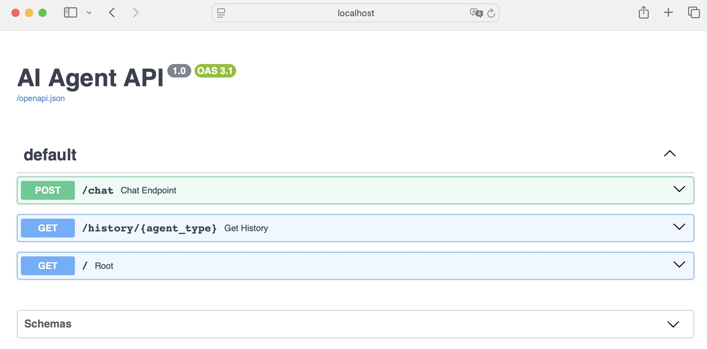
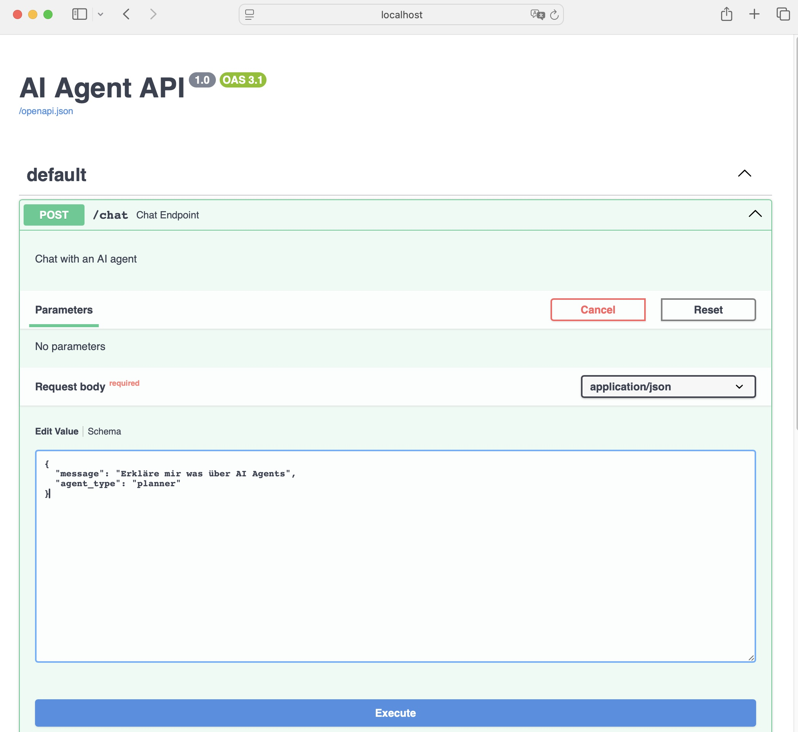
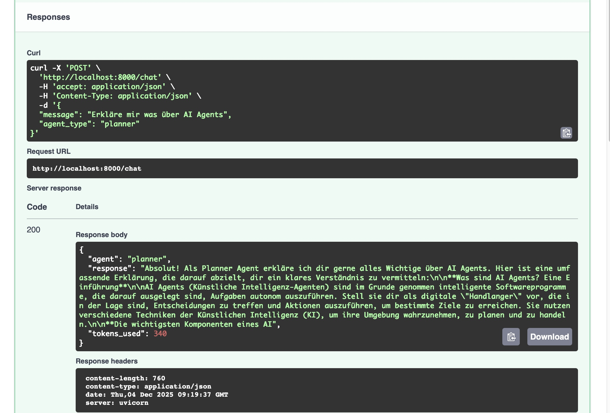

Und noch ein fundamentales Konzept für unser Projekt: FastAPI.

## Was ist FastAPI?

Genau das habe ich mich auch gefragt. Also fast... Ich kannte es und weiß wofür man es einsetzt, aber nicht ganz genau, wie man es implementiert. Wieder etwas dazulernen!

FastAPI ist ein Python-Framework, um Web-APIs zu erstellen. Es macht aus unserem Python-Code einen Webserver, den man über HTTP aufrufen kann - ähnlich wie eine Website, aber eben für Programm-zu-Programm-Kommunikation.

Dieses Mal fange ich mit dem Ergebnis an. Wenn man das nachher folgende Skript ausführt, dann wird ein Service gestartet, den man über die angegebene IP bzw. den localhost aufrufen kann.

```bash
============================================================
TAG 5: FASTAPI REST API
============================================================

🚀 Starting API server...
📖 API Docs: http://localhost:8000/docs
🧪 Test: curl -X POST http://localhost:8000/chat -H 'Content-Type: application/json' -d '{"message": "Hello", "agent_type": "planner"}'

INFO:     Started server process [10735]
INFO:     Waiting for application startup.
INFO:     Application startup complete.
INFO:     Uvicorn running on http://0.0.0.0:8000 (Press CTRL+C to quit) @docs/linkedin_code_snippets/day_05_fastapi.py 
```

Daraufhin öffnet sich im Browser diese GUI.



Wenn man sich an die vorgegebene Struktur im Chat-Fenster hält, dann erhält man eine entsprechende Antwort, die von unserem lokal gehostetem LLM generiert wird.

**Prompt**


**Response**


Man kann das aber natürlich im Terminal ausführen. Ein typischer Befehl könnte so aussehen:

```bash
curl -X POST http://localhost:8000/chat \
  -H 'Content-Type: application/json' \
  -d '{"message": "Hello", "agent_type": "planner"}'
```

Das führt dann zu dem folgenden Output im Terminal:

```bash
{"agent":"planner","response":"Hello there! 👋 \n\nIt's good to hear from you. How can I help you today?  Do you have any questions, or is there something specific you'd like to discuss? \n\nI'm ready for anything! 😊\n\n\n\n","tokens_used":404}% 
``` 

Es gibt noch viel mehr Möglichkeiten, diese API zu nutzen. Bis hierher erstmal nur die einfachste. Man kann komplexe APIs bauen, verschiedene Endpunkte und Methoden nutzen, Authenfizierung und Autorisierung einbauen, Daten validieren, automatisierte Dokumentationen generieren und so weiter und so fort...

Aber nun wird es Zeit mal etwas zu programmieren. Ich werde hier nicht alles zeigen, aber den kompletten Code kannst du dir in meinem Repository ansehen.

## Implementierung

### Lokales LLM
Der Klassiker... Verbindung zum lokalen LLM herstellen.

```python
from openai import OpenAI

client = OpenAI(
    base_url="http://localhost:1234/v1",
    api_key="not-needed"
)
```

Aber anders als bisher übergebe ich den Modell-Namen heute an anderer Stelle. Dort wo ich meinen Endpunkt definiere. Wir werden später darüber stolpern.
Das bietet mir unter Anderem die Freiheit für verschiedene Agenten unterschiedliche Modelle zu definieren. 

### FastAPI Grundlagen

```python
from fastapi import FastAPI

app = FastAPI(title="AI Agent API", version="1.0")
```

FastAPI erstellt eine Webanwendung mit Titel und Version.

### Pydantic Modells

Pydantic dient uns für einen strukturierten Output bzw. für die Datenvalidierung. 

```python
from pydantic import BaseModel

class ChatRequest(BaseModel):
    message: str
    agent_type: str = "planner"

class ChatResponse(BaseModel):
    agent:str
    response: str
    Tokens_used: int
```

Das BaseModel definiert die Struktur von eingehenden und ausgehenden Daten. Es bietet eine automatisierte Validierung, ob message ein String oder Tokens_used ein Integer ist usw.

Das ist super praktisch, weil ich mich nicht um die Datenprüfung kümmern muss – Pydantic übernimmt das für mich und sorgt automatisch für saubere, sichere Daten. So kann ich mich voll auf die eigentliche Logik konzentrieren.

### HTTP-Methoden (Endpunkte)

Kommen wir zu dem Teil, an den ich mich in der Vergangenheit nicht wagen musste. Oder durfte ...

#### POST-Endpunkt

Der HTTP-Endpunkt POST `@app.post` dient in unserem Fall beispielsweise dem Senden von Chat-Nachrichten. 

```python
@app.post("/chat", response_model=ChatResponse)
def chat_endpoint(request: ChatRequest):
    """Chat with an AI agent"""

    # Get or create conversation history
    if request.agent_type not in conversations:
        conversations[request.agent_type] = []

    # Add user message
    conversations[request.agent_type].append({
        "role": "user",
        "content": request.message
    })

    # Generate response
    response = client.chat.completions.create(
        model="google/gemma-3n-e4b",
        messages=[
            {"role": "system", "content": f"You are a {request.agent_type} agent."},
            *conversations[request.agent_type]
        ],
        max_tokens=150
    )

    agent_message = response.choices[0].message.content

    # Add to history
    conversations[request.agent_type].append({
        "role": "assistant",
        "content": agent_message
    })

    return ChatResponse(
        agent=request.agent_type,
        response=agent_message,
        tokens_used=response.usage.total_tokens
    )
```

Ich definiere einen sogenannten POST-Endpunkt für die API. Das bedeutet: Wenn jemand eine HTTP-POST-Anfrage an `/chat` schickt (z.B. mit curl oder aus dem Browser), wird die Funktion `chat_endpoint` ausgeführt.

Und dann geht es los, Schritt für Schritt:

1. **Eingabe und Validierung**  
   Die Funktion bekommt ein `request`-Objekt vom Typ `ChatRequest`. Das enthält die Nachricht (`message`) und den Agententyp (`agent_type`). FastAPI und Pydantic prüfen automatisch, ob die Daten korrekt sind.

2. **Konversationshistorie verwalten**  
   Es gibt ein Dictionary namens `conversations`. Für jeden Agententyp wird darin die bisherige Konversation gespeichert. Falls es für den Agenten noch keine Historie gibt, wird eine neue Liste angelegt.

3. **User-Nachricht speichern**  
   Die aktuelle Nachricht des Nutzers wird als Dictionary (`role: user, content: ...`) zur Historie hinzugefügt.

4. **Antwort generieren**  
   Das LLM bekommt alle bisherigen Nachrichten (inklusive System-Message) und generiert eine Antwort.  
   Die System-Message sagt dem Modell, welche Rolle es einnehmen soll (z.B. "You are a planner agent"). Das ist ähnlich dem Persona, dass man auch gerne so im Prompt übergibt. Die Historie wird als Liste von Nachrichten übergeben.

5. **Agent-Antwort speichern**  
   Die Antwort des Agenten wird ebenfalls zur Historie hinzugefügt (`role: assistant, content: ...`).

6. **Antwort zurückgeben**  
   Die Funktion gibt ein `ChatResponse`-Objekt zurück. Das enthält den Agententyp, die generierte Antwort und die Anzahl der verwendeten Tokens (nützlich für Kosten und Limits).

Mit diesem Endpunkt kann ich per HTTP-POST eine Nachricht an einen KI-Agenten schicken und bekomme eine KI-generierte Antwort zurück. Die Konversation wird für jeden Agententyp gespeichert, sodass der Agent sich an den bisherigen Verlauf "erinnert". 

#### GET-Endpunkt

Der GET-Endpunkt `/history/{agent_type}` ist das Gegenstück zum POST-Endpunkt und dient dazu, die aktuelle Konversationshistorie eines Agenten abzurufen.

```python
@app.get("/history/{agent_type}")
def get_history(agent_type: str):
    """Get conversation history"""
    return {
        "agent": agent_type,
        "messages": conversations.get(agent_type, []),
        "count": len(conversations.get(agent_type, []))
    }
```

Ich definiere einen GET-Endpunkt für die API. Das bedeutet, analog zum POST-Endpunkt: Wenn jemand eine HTTP-GET-Anfrage an `/history/{agent_type}` schickt, wird die Funktion `get_history` ausgeführt.

Das führt dann zu folgendem Ablauf:

1. **Parameterübergabe**  
   Der Agententyp wird als Teil der URL übergeben (z.B. `/history/planner`). FastAPI extrahiert diesen Wert und übergibt ihn als String an die Funktion.

2. **Historie abrufen**  
   Die Funktion sucht im Dictionary `conversations` nach dem passenden Agenten und gibt die gespeicherte Konversation als Liste zurück. Falls keine Historie existiert, wird eine leere Liste geliefert.

3. **Antwort strukturieren**  
   Die Antwort ist ein Dictionary mit drei Feldern:
   - `"agent"`: Der Name des Agenten
   - `"messages"`: Die komplette Konversationshistorie als Liste von Nachrichten
   - `"count"`: Die Anzahl der Nachrichten in der Historie

Mit dem GET-Endpunkt kann ich jederzeit die aktuelle Konversation eines Agenten abfragen und bekomme den kompletten Verlauf als Dictionary zurück – inklusive Agentenname und Nachrichtenanzahl. Das ist praktisch für Debugging, Frontend-Anzeige oder einfach, um zu sehen, was der Agent bisher „weiß“.

#### Root
Hierbei handelt es sich auch um einen GET-Endpoint. Der Unterschied hier ist, dass man auf die Basis URL geleitet wird. 

```python
@app.get("/")
def root():
    return {
        "message": "AI Agent API",
        "docs": "/docs",
        "endpoints": {
            "chat": "POST /chat",
            "history": "GET /history/{agent_type}"
        }
    }
```

Das ist einfach eine kleine Startseite für die API – hier gibt’s einen Überblick, wo die wichtigsten Endpunkte und die Doku zu finden sind. Praktisch für alle, die die API entdecken oder testen wollen.

Bleibt noch uvicorn.

### Uvicorn

```python
    uvicorn.run(app, host="0.0.0.0", port=8000)
```

In FastAPI-Projekten wie dem meinen, wird Uvicorn als Server genutzt, um die Anwendung auszuführen. Es startet den Webserver, nimmt HTTP-Anfragen entgegen und leitet sie an die FastAPI-App weiter. Oder in kurz: Uvicorn übernimmt das Hosting und Routing der API-Endpunkte, die ich in FastAPI definiert habe.

Getestet haben wir das ganze ja schon zu Beginn des Beitrags. Bleibt eigentlich nur die Frage: Und wofür ist das alles nun gut?

## Zusammenfassung

FastAPI ist die zentrale Schnittstelle meines Projekts. Sie verbindet alle Agenten, Services und Microservices über standardisierte HTTP-Endpunkte – egal ob Memory Service, Simulation, Orchestrator oder externe Tools. Dadurch kann ich:

- Aus jedem beliebigen Programm, das HTTP-Anfragen senden kann (Frontend, andere Python-Skripte, Automatisierungstools), mit dem Agenten oder Service kommunizieren.
- Die Architektur flexibel und erweiterbar halten: Neue Services lassen sich einfach integrieren, austauschen oder skalieren.
- Die Logik zentral weiterentwickeln, ohne dass sich die Clients darum kümmern müssen.
- Die automatisch generierte API-Dokumentation nutzen – Entwicklung und Debugging werden extrem komfortabel.
- Microservices wirklich entkoppelt betreiben: Jeder Service arbeitet unabhängig, aber über die API orchestrierbar.

Kurz gesagt: FastAPI verbindet alles. Ich kann meine Agenten und Services von überall ansprechen. Die API macht das System flexibel, erweiterbar und einfach zu testen. Ohne FastAPI wäre das Zusammenspiel der Komponenten viel komplizierter.